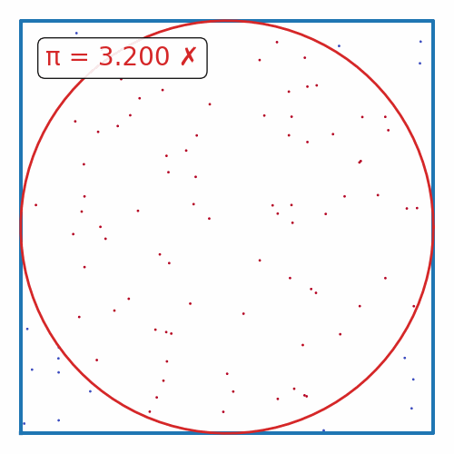
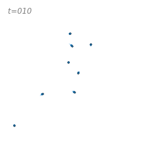

# Parallel Techniques with Python

The goals of this tutorial:
- Basic concepts of parallelization
- vectorization
- threads/processes/GIL
- MPI
- GPU/TPUs
- High-level python parallelization techniques

We'll go over some details (~10 min + QA) and then break into groups of 2-3 to work on some exercises.

The exercises:
|              |                                    |
|:-------------|:----------------------------------:|
| π-estimation |    |
| N-Body sim   |  |
| Fractals     |  |