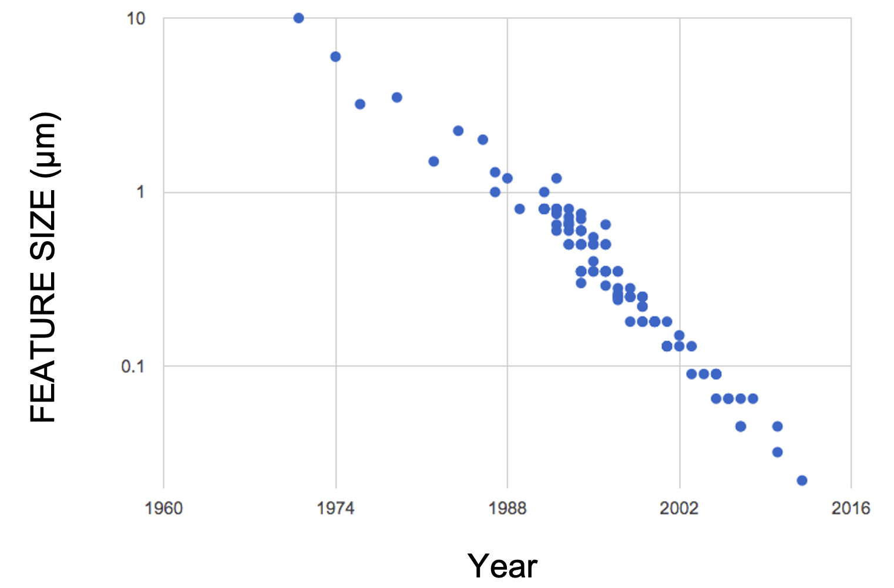
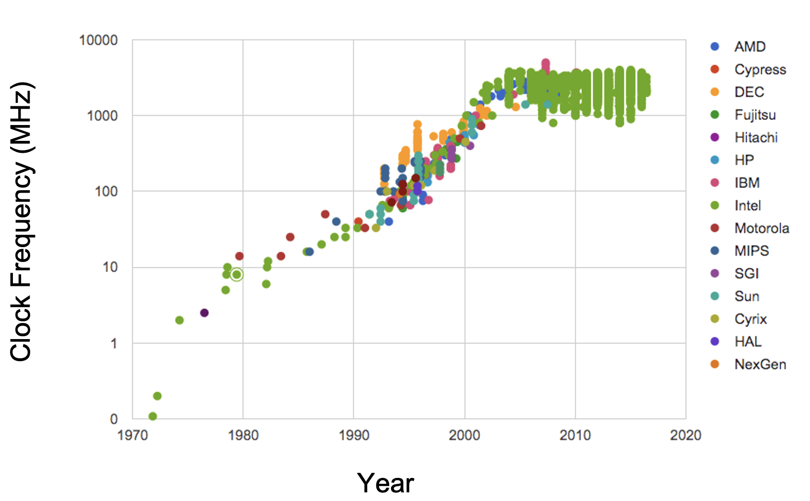
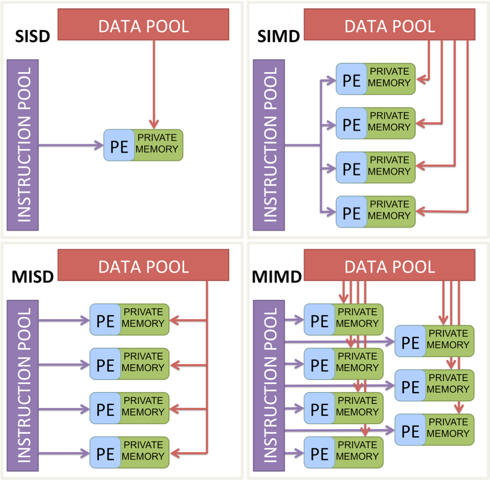
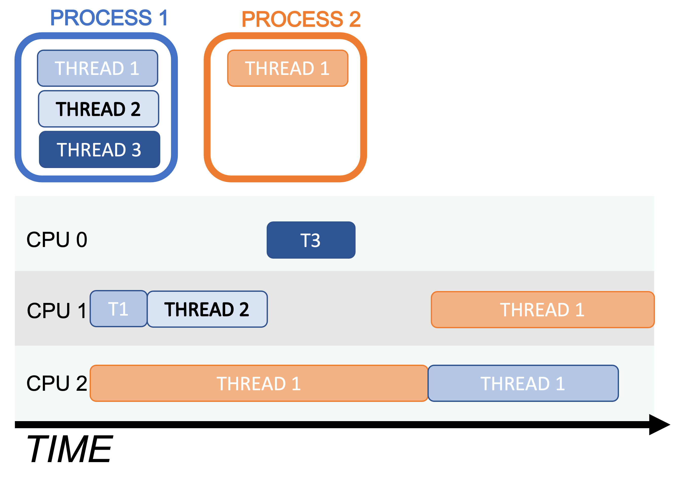
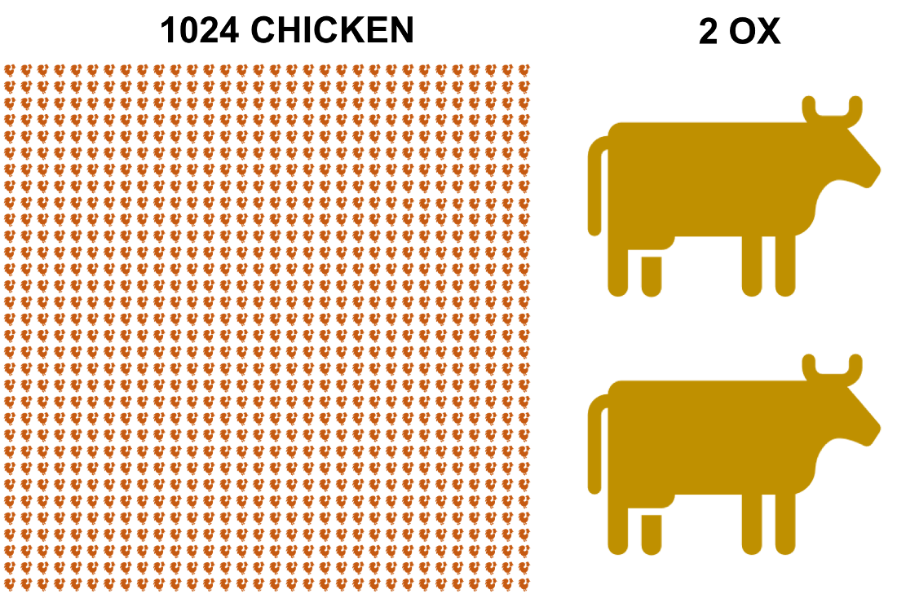
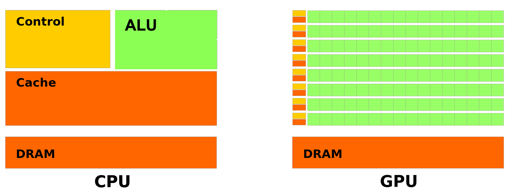
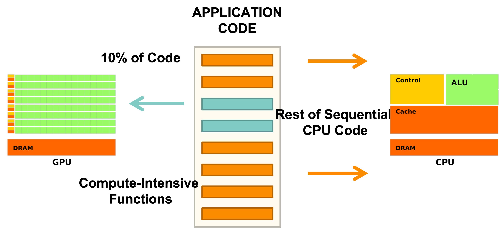

# Overview


There are several ways to increase the number of computations per second. Some include:
1. Increasing the number of computations per clock cycle:
    - by adding more transistors to a single CPU
    - by increasing the clock speed of a single CPU
2. Increasing the number of 'workers' crunching computations:
    - by adding more 'cores' to a single machine
    - by adding more machines to a network
    - by using specialized hardware to do the math (e.g., GPUs, TPUs, FPGAs, etc.)


The first approach is called **serial** computing, and the second approach is called **parallel** computing.

Unfortunately, the first approach has hit a wall. See the figures from the [Standford VLSI Group's CPU DB](http://cpudb.stanford.edu/visualize/clock_frequency).
|Features on a chip | Clock speed |
|:------------------|:-----------:|
|          |        |

Due to physical limitations on the construction of chips and circuit boards, we're unlikely to make drastic improvements in increasing the performance of single-chips. 
Parallel computing can be a way forward.


## Flynn's taxonomy and "types" of parallelization




1. **SISD**: Single processor, single instruction, and data stream. This is the good old sequential computing we're used to.
2. **SIMD**: Single processor, same instruction on multiple data streams in parallel. The 'embarrassingly parallel' type of parallelization, all the data needs to be processed in the same way.
3. **MISD**: Multiple processors with different instructions on the same data. Say you want to calculate the mean and standard deviation of a dataset. You can do this in parallel by having one processor calculate the mean, and another calculate the standard deviation.
4. **MIMD**: Multiple processors with different instructions on different data. Your laptop's CPU is a MIMD machine. It has multiple cores, and each core can run different instructions on different data. Eg -- one core can be running a web browser, another can be running a word processor, and another can be running a python script.


```{note}
For this tutorial we will focus on the SIMD (Single Instruction Multiple Data) type of parallelization.
```

## Vectorization

Vectorization is a vertical scaling technique that uses a single CPU core or a GPU more effectively. 
You can compute N operations at the same time _if they are all the same operation._ (SIMD)

<center></center>


If you don't fully utilize all cores, that's okay; someone else's work can fill the gaps.
If you don't fully utilize the core's vector unit, no one else can use them. :( 

## Multiprocessing vs Multithreading

**Multiprocessing** involves running multiple processes concurrently using multiple processors. Processes are chains of instructions (programs). This can happen on one machine with multiple CPUs or across a network of machines, often referred to as a cluster. Each process in multiprocessing has its own memory space. For using multiple CPUs on a cluster, we need to use **MPI**, the message passing interface, for passing messages between processes. We won't cover MPI in this tutorial, but if you're interested, check out [mpi4py](https://mpi4py.readthedocs.io/en/stable/), and for GW CBC data analysis, this codebase I helped develop: [Parallel Bilby](https://git.ligo.org/lscsoft/parallel_bilby/).

**Multithreading** is similar but threads share the same memory space. Python's native support for multithreading is limited due to [legacy design
features](https://wiki.python.org/moin/GlobalInterpreterLock), but scientific libraries like NumPy and Numba can bypass these restrictions for efficient execution.




### Implicit Multithreading in NumPy

You've most likely been using multithreading and multicores in your Python code, especially if you've used NumPy. NumPy cleverly employs multithreading across cores in much of its compiled code. Here is an examples to illustrate this.

Run `htop` on your computer in one terminal and then run the following code in a python session:
```python 
import numpy as np

n = 20
m = 1000
for i in range(n):
    x = np.random.randn(m, m)
    y = np.linalg.eigvals(x)
```  

The output of the htop system monitor on my laptop while
this code is running:

| | |
|-- |--|
|Not running| ![not_running]|
|Running| ![running]|

[not_running]: https://github.com/avivajpeyi/parallelization_techniques/assets/15642823/0fb4a33f-ddf1-45e3-8762-8013f5d14f45
[running]: https://github.com/avivajpeyi/parallelization_techniques/assets/15642823/38870043-7e25-40ea-8a63-6fdd1bbc122d

We can see that 6 of the 12 CPUs on my laptop were running at full speed. 

This is because NumPy’s `eigvals` routine neatly splits up the tasks and
distributes them to different threads.


## GPU computing


The pioneer of multiprocessing, and "Father of supercomputing", [Seymour Cray](https://www.britannica.com/biography/Seymour-R-Cray), once said:
> If you were plowing a field, which would you rather use? Two strong oxen or 1024 chickens?”
>
> - Seymour Cray,



Cray considered this an obvious question, as to him, it is absurd to plough a field with chickens.
He thought it would be absurd to use several processors to crunch
computations in parallel, in place of one fast processor to crunch computations sequentially.
By the early 2000s, views began to shift...

A GPU (Graphics Processing Unit) is a specialized processor that is designed to perform floating point operations (FLOPs) in parallel, using SIMD (Single Instruction Multiple Data) instructions with a large number of cores.


```{warning}
A GPU wont be able to _replace_ CPUs, as it is not designed to do the same things. GPUs are designed to do a few things very well, and CPUs are designed to do many things well. 
```

In coding, we can use GPUs to do the heavy lifting of crunching numbers in parallel, and CPUs to do the heavy lifting of managing the program flow:



Very relevant video of [several thousand chickens fighting a few T-rexes](https://www.youtube.com/watch?v=Tc_JWE_ypEk)

